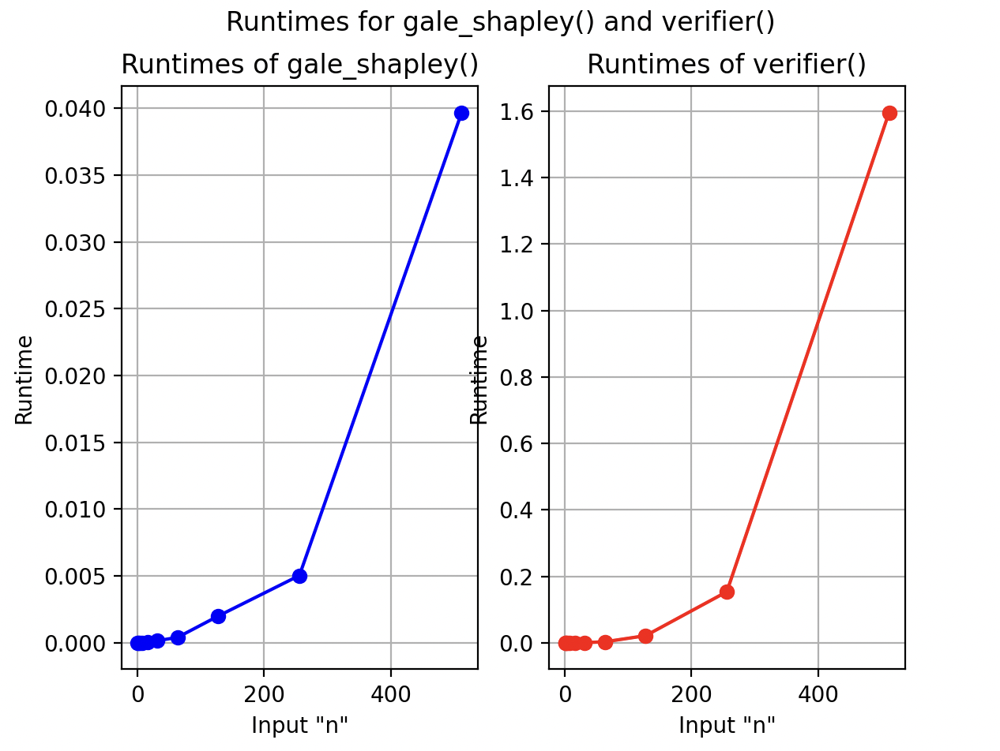
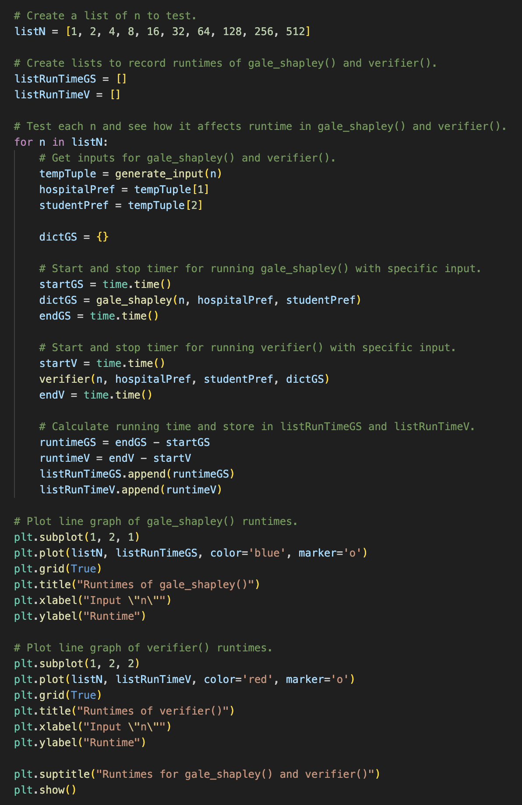

# Programming Assignment 1: Matching and Verifying
## COP4533

### Students: Finn Walker (UFID: 11388586) and Sara Lin (UFID: 49424527)

### **Structure of Repository**
    data (contains the example input/output files to run)
        example.in
        example.out

    images (contains the graph and solution images for Task C)
        Task_C_Graph.png
        Task_C_Solution.png

    data_helpers.py (helper functions to parse/pack the input/output and generate input/output files)

    gale_shapley.py (the matcher)

    verifier.py (the verifier)

    README.md

### **To run the matcher:**
1. Run either command in the command line:
* cat data/example.in | python gale_shapley.py
    * This will utilize our already made input file in the "data" folder and pass that into our matcher.
* python gale_shapley.py
    * This will allow the user to manually type in the inputs to the matcher. The user must type the input in the format:  
    n  
    hospital's preference list (n lines, n numbers long each)  
    student's preference list (n lines, n numbers long each)
    * Example user input:  
    3  
    1 2 3  
    2 3 1  
    2 1 3  
    2 1 3  
    1 2 3  
    1 2 3  

The pairings from the matcher should print in the command line. The pairings should match the "example.out" file in "data/example.out". 

### **To run the verifier:**

### **To get the graph for runtimes of the matcher and verifier:**

### **Assumptions**
* Have "python" already installed.
* Have "matplotlib" already installed.
    * To install this, do:  
    pip -m install matplotlib

### **Graph for Task C**

Based on the graphs, the runtimes grow similarly at n^2 time complexity.

### **Solution to Task C**

